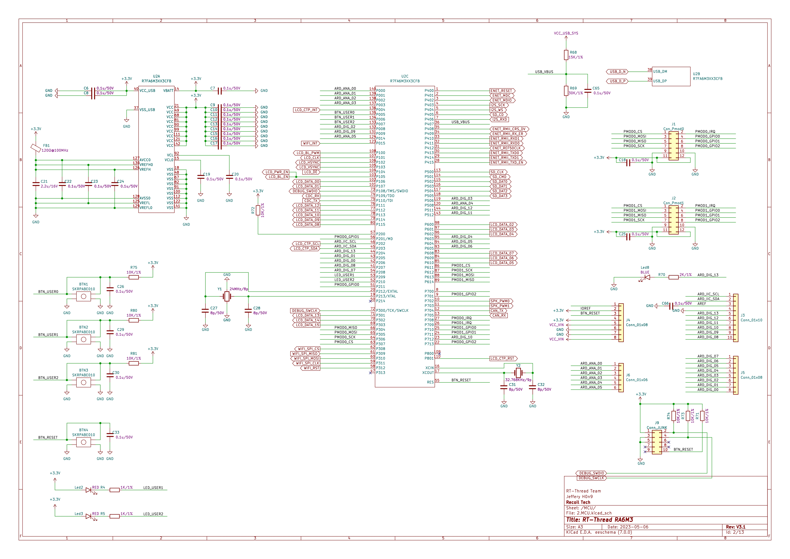

# ra6m3-hmi-board 开发板的Arduino生态兼容说明

## 1 RTduino - RT-Thread的Arduino生态兼容层

ra6m3-hmi-board 开发板已经完整适配了[RTduino软件包](https://github.com/RTduino/RTduino)，即RT-Thread的Arduino生态兼容层。用户可以按照Arduino的编程习惯来操作该BSP，并且可以使用大量Arduino社区丰富的库，是对RT-Thread生态的极大增强。更多信息，请参见[RTduino软件包说明文档](https://github.com/RTduino/RTduino)。

### 1.1 如何开启针对本BSP的Arduino生态兼容层

Env 工具下敲入 menuconfig 命令，或者 RT-Thread Studio IDE 下选择 RT-Thread Settings：

```Kconfig
Hardware Drivers Config --->
    Onboard Peripheral Drivers --->
        [*] Compatible with Arduino Ecosystem (RTduino)
```

## 2 Arduino引脚排布

更多引脚布局相关信息参见 [pins_arduino.c](pins_arduino.c) 和 [pins_arduino.h](pins_arduino.h)。


| Arduino引脚编号  | STM32引脚编号 | 5V容忍 | 备注  |
| ------------------- | --------- | ---- | ------------------------------------------------------------------------- |
| 0 (D0) | PD0 | 是 | Serial2-RX,默认被RT-Thread的UART设备框架uart4接管 |
| 1 (D1) | PD1 | 是 | Serial2-TX,默认被RT-Thread的UART设备框架uart4接管 |
| 2 (D2) | PD2 | 是 | 板载用户LED |
| 3 (D3) | PD3 | 是 |  |
| 4 (D4) | PD4 | 是 |  |
| 5 (D5) | PD5 | 是 |  |
| 6 (D6) | PD6 | 是 |  |
| 7 (D7) | PD7 | 是 |  |
| 8 (D8) | PD8 | 是 |  |
| 9 (D9) | PD9 | 是 | SPI片选默认引脚 |
| 10 (D10) | PD10 | 是 | PWM2-CH2,默认被RT-Thread的PWM设备框架pwm2接管 |
| 11 (D11) | PD11 | 是 | SPI4-MOSI,默认被RT-Thread的SPI设备框架spi4接管 |
| 12 (D12) | PD12 | 是 | SPI4-MISO,默认被RT-Thread的SPI设备框架spi4接管 |
| 13 (D13) | PD13 | 是 | SPI4-SCK,默认被RT-Thread的SPI设备框架spi4接管 |
| 14 (D14) | PD14 | 是 | I2C1-SDA,默认被RT-Thread的I2C设备框架i2c1接管 |
| 15 (D15) | PD15 | 是 | I2C1-SCL,默认被RT-Thread的I2C设备框架i2c1接管 |
| 16 (A0) | PA0 | 是 | ADC1-CH0-EXTVOL(外部电压),默认被RT-Thread的ADC设备框架adc1接管 |
| 17 (A1) | PA1 | 是 | ADC1-CH0-EXTVOL(外部电压),默认被RT-Thread的ADC设备框架adc1接管 |
| 18 (A2) | PA2 | 是 | ADC1-CH0-EXTVOL(外部电压),默认被RT-Thread的ADC设备框架adc1接管 |
| 19 (A3) | PA3 | 是 | ADC1-CH7-EXTVOL(外部电压),默认被RT-Thread的ADC设备框架adc1接管 |
| 20 (A4) | PA4 | 是 | ADC1-CH19-EXTVOL(外部电压),默认被RT-Thread的ADC设备框架adc1接管 |
| 21 (A5) | PA0 | 是 | ADC1-CH5-EXTVOL(外部电压),默认被RT-Thread的ADC设备框架adc1接管 |

> 注意：
>
> 1. xxxxxxxxx
> 2. xxxxxxxxx
